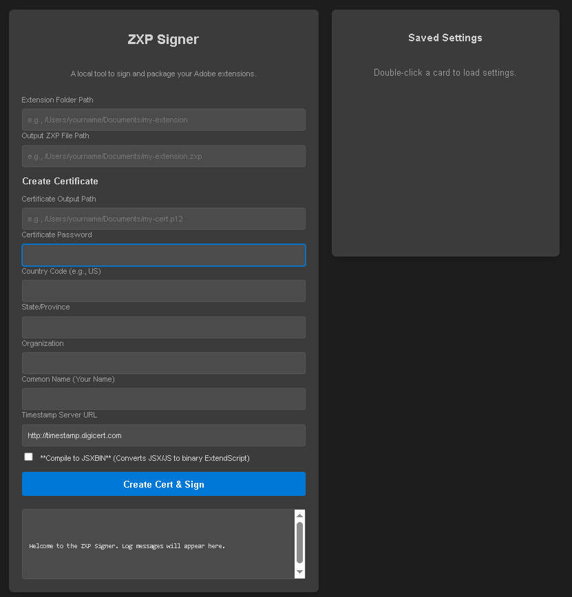

# ZXP Signer and Build Tool (Node.js/Express)

A local, web-based utility for Adobe Extension developers to simplify the process of creating, signing, and packaging ZXP files, with the added benefit of **ExtendScript (JSX) obfuscation** via JSXBIN compilation.

This tool is designed to be run locally, providing a user-friendly interface to manage the full ZXP build lifecycle: Copy Source -> Obfuscate ExtendScript -> Create Self-Signed Certificate -> Sign ZXP -> Verify Signature.

## ✨ Features

* **Web-Based Interface:** Easy-to-use form for all signing and certificate parameters.
* **One-Click Build:** Handles certificate creation, ZXP packaging, digital signing, and timestamping in a single action.
* **Secure Build Process:** A **temporary copy** of your entire project is created for all compilation and signing steps, ensuring your **original source folder remains untouched**.
* **Persistent Settings:** Saves non-sensitive form inputs (paths, names, etc.) in the browser's local storage and allows saving/loading of full configurations to a panel.
* **JSXBIN Compilation:** Optional feature to compile `.jsx` files to the more secure, obfuscated `.jsxbin` format **before** packaging, protecting your intellectual property.
* **Signature Verification:** Runs a verification check on the final ZXP file to ensure Adobe standards compliance.

---

## 🚀 Setup and Installation

### Prerequisites

You need **Node.js** installed on your system.

### Steps

1.  **Clone or Download:** Get the project files onto your local machine.
2.  **Install Dependencies:** Navigate to the project folder in your terminal and run:

    ```bash
    npm install
    ```

3.  **Start the Server:** Launch the Node.js Express server:

    ```bash
    npm start
    ```

    The terminal will show the running address: `ZXP Signer backend running at http://localhost:3050`.

4.  **Access the Tool:** Open your web browser and navigate to `http://localhost:3050`.

---

## 💻 Usage and Important Notes

### Key Requirements

⚠️ **Always use absolute paths** for all file and folder fields (Extension Folder Path, Output ZXP File Path, Certificate Output Path) for reliable operation across different operating systems.

### Main Form Fields

| Field | Description | Example |
| :--- | :--- | :--- |
| **Extension Folder Path** | The **absolute path** to your source extension folder (containing the `CSXS` folder). | `/Users/username/Projects/my-extension-panel` |
| **Output ZXP File Path** | The **absolute path and filename** where the final `.zxp` file should be saved. | `/Users/username/Desktop/my-extension-v1.0.zxp` |
| **Certificate Output Path** | The **absolute path and filename** where the `.p12` certificate file will be created/used. | `/Users/username/Certs/dev-cert.p12` |
| **Compile to JSXBIN** | **(Optional)** Check this box to obfuscate your ExtendScript files (e.g., `.jsx`) into `.jsxbin` format during the build. | ✅ Checkbox |

### The Build Process

1.  Fill out all required fields.
2.  Check **Compile to JSXBIN** if you want to obfuscate your code.
3.  Click **Create Cert & Sign**.
4.  Monitor the **Log Messages** box for real-time output.

---

## 🔒 JSXBIN Obfuscation Details

For Adobe Creative Cloud extensions, protecting your core ExtendScript logic is critical. When you enable **Compile to JSXBIN**:

* The tool **only compiles the ExtendScript file referenced by the `<ScriptPath>` tag** within the `CSXS/manifest.xml` of the **temporary build folder**.
* The original `.jsx` file is **deleted** from the temporary directory.
* The temporary `manifest.xml` is **updated** to point to the new, binary `.jsxbin` file before the ZXP package is created.

This process ensures that your final ZXP file contains the compiled, obfuscated `.jsxbin` code, providing a strong layer of protection for your intellectual property without modifying your source project.


## 🛣️ Future Roadmap & Development Plans 💡

We are continually enhancing the ZXP Signer Tool to support more complex build workflows and integrate with modern development platforms, facilitating its role in **video automation platforms** and CI/CD pipelines.

### 1. Integration & Automation Focus (API/CLI)

* **REST API Endpoints:** Develop secure, dedicated endpoints to trigger the full build/sign/obfuscate workflow programmatically. This is essential for integrating the ZXP creation step into **Continuous Integration/Continuous Deployment (CI/CD) pipelines** or custom web platforms.
* **Command-Line Interface (CLI):** Introduce a fully featured CLI mode to allow developers to execute all functions (signing, cert creation, JSXBIN) from a terminal without relying on the web interface.
* **Adobe Exchange Submission Hook:** Investigate adding a final step to automatically validate and push the signed ZXP file to the Adobe Exchange Partner API upon successful build.

### 2. ExtendScript Obfuscation Enhancements

* **Manifest.xml Path Validation:** Implement better front-end checks to ensure the `ScriptPath` referenced in `manifest.xml` actually exists before starting the build.
* **Source Map Generation for Debugging:** Explore methods to generate obfuscation source maps (if technically feasible/compatible) for a development/debug build to allow for local error tracking without revealing production code.
* **JavaScript Engine (CEP/UXP) Modernization:** As Adobe transitions panels to UXP/modern JavaScript, explore support for modern JS bundling (e.g., Webpack/Rollup) within the packaging process, rather than relying solely on legacy JSX/JSXBIN.

### 3. User Experience & Reliability

* **Persistent Certificate Management:** Implement a more robust system for saving and managing multiple certificate profiles locally (separate from browser local storage), which would be password-protected on disk.
* **Detailed Build Logs:** Improve log granularity, including timestamping for each major step (Copy, JSXBIN, Cert Creation, Sign, Verify) to assist in troubleshooting build failures.
* **Cross-Platform UI Testing:** Ensure the Node/Express web UI remains fully responsive and functional across major operating systems (Windows, macOS).